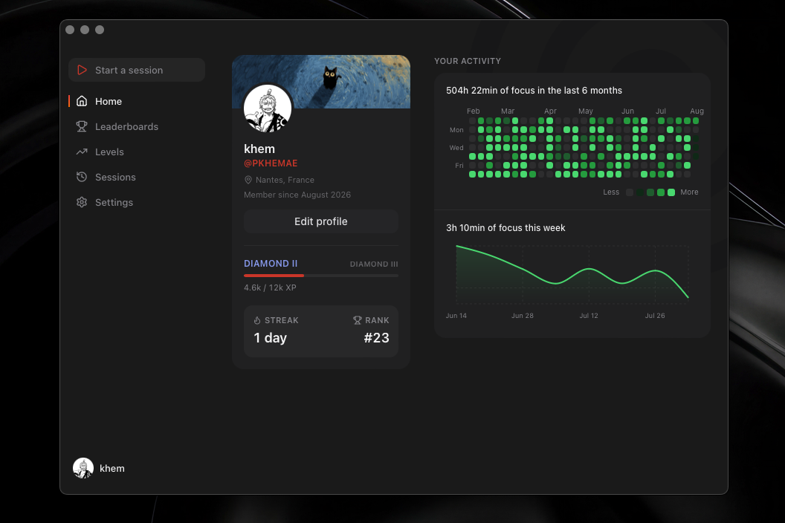

<div align="center">



### Find your focus.

Atlas helps students study without distractions — focused sessions, healthy
breaks, and progress you can actually see.

[](LICENSE)
[](CONTRIBUTING.md)

[Contributing](CONTRIBUTING.md) · [Code of Conduct](CODE_OF_CONDUCT.md)

</div>

---

## Why Atlas

Studying is a fight against your own screen. Atlas turns focus into something
you start, protect and measure: launch a session, let the app step out of the
way, and watch consistency compound into real progression.

- **One button, zero friction** — start a session and the app collapses into a
  tiny always-on-top dock that follows you across every desktop and fullscreen
  space.
- **Your effort, made visible** — a GitHub-style activity graph, weekly focus
  charts, and a rank that reflects how consistently you actually show up.
- **Honest by design** — every timer, streak and ranking is computed
  server-side from real session data. No client-side wishful thinking.

## Features

### Focus sessions

Start, pause, resume, complete — the server owns all time math, so the timer
never drifts and pauses never count. The floating dock keeps the session (and
its controls) visible without stealing your screen.

### Ambient sounds

Real recorded rain, looped seamlessly with the Web Audio API — gapless, with
gain-ramp fades and per-sound volume. More sounds are one asset away.

### Levels & the road

Focused minutes earn XP. Consecutive days multiply it (up to ×1.5); every idle
day decays it — your rank tracks the recent you, not the you of last semester.
Fifteen ranks from Bronze I to Diamond III, laid out as a winding road of
badges with a "you are here" marker.

### Leaderboards

Daily, weekly and monthly rankings of focus time across all users — top 10,
podium medals, and your own position with the rivals around it. Weeks are ISO
weeks: the same arena for everyone.

### Make it yours

Named themes (Atlas, Midnight, Daylight — dark and light), full
internationalization (English and French), profile customization with avatars
and banners.

## Tech stack

Turborepo monorepo, pnpm workspaces:

| Directory           | What it is                                              |
| ------------------- | ------------------------------------------------------- |
| `apps/desktop`      | Tauri 2 desktop app — React 19, Vite, Tailwind CSS v4   |
| `apps/api`          | AdonisJS v7 API — Lucid ORM, SQLite, access-token auth  |
| `apps/marketing`    | TanStack Start marketing site                           |
| `packages/ui`       | Shared shadcn/ui component library (consumed as source) |
| `packages/*-config` | Shared TypeScript and ESLint presets                    |

## Getting started

Prerequisites: [Node.js](https://nodejs.org) 24+, [pnpm](https://pnpm.io),
and the [Rust toolchain](https://rustup.rs) for the desktop app.

```bash
git clone https://github.com/pkhemae/atlas.git
cd atlas
pnpm install
```

Run the pieces you need:

```bash
pnpm --filter @atlas/api dev            # API on http://localhost:3334
pnpm --filter @atlas/desktop tauri dev  # desktop app (compiles Rust on first run)
pnpm dev                                # marketing site on http://localhost:3000
```

Useful extras:

```bash
pnpm --filter @atlas/api test    # API test suites (japa)
pnpm lint                        # ESLint across the monorepo
pnpm check-types                 # TypeScript across the monorepo
```

To fill the app with demo data, seed the API database (see
`apps/api/database/seeders/`).

## Contributing

Issues and pull requests are welcome — read the
[contributing guide](CONTRIBUTING.md) first, and be excellent to each other
per the [code of conduct](CODE_OF_CONDUCT.md).

## License

Atlas is free and open source under the
[GNU AGPL-3.0](LICENSE). Use it, learn from it, build on it — and if you run
a modified version for others, share your changes back. That's the whole deal.
